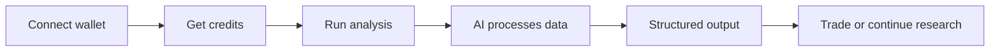

<p align="center">
  
</p>

<h1 align="center">Astreon Analytics</h1>

<div align="center">
  <p><strong>Astreon is an on-chain analytics platform that unifies markets, structure, and risk into a single system for informed analysis and decision-making></p>
  <p>Token intelligence • Wallet profiling • Protocol flows • Agents • API • Credit-based usage</p>
</div>

---

### 🚀 Quick Links

[](https://your-app-link)
[](https://your-docs-link)
[](https://api.astreon.xyz)
[](https://x.com/your_account)
[](https://t.me/your_channel)

---

## Overview

Astreon Analytics is a multi-chain on-chain analytics and research platform designed for traders, research teams, protocol operators, and builders who need more than scattered tabs and disconnected dashboards

Instead of splitting your workflow between charts, explorers, screenshots, notes, and spreadsheets, Astreon gives you one environment where market context, structural analytics, and repeatable research can live together

> [!IMPORTANT]
> Astreon is not a signal service and does not provide guaranteed outcomes or buy/sell calls  
> It is built to help users understand what they are looking at before they act

The platform is designed around a simple idea: if your market view, risk view, and research layer are disconnected, your decisions become slower, noisier, and easier to distort

That is the gap Astreon is built to close

---

## How It Works



Astreon follows a practical research loop that takes the user from discovery to structured action without forcing them into five separate tools

| Step | What happens | Result |
|------|--------------|--------|
| 1 | Connect wallet or create account | Product context is created |
| 2 | Receive free tier access or add credits | Usage capacity is unlocked |
| 3 | Scan markets and open analytics | Relevant targets are identified |
| 4 | AI and analytics layers process data | Structure, risk, and context become visible |
| 5 | Output is saved into lists or workflows | Research becomes reusable |
| 6 | User continues manually or extends with agents/API | Workflow scales over time |

> [!TIP]
> The best way to use Astreon is not to run heavy analytics on everything  
> Start with market scanning, shortlist only what matters, then go deeper with Insights

---

## User Flow

### 1 → Discover

The user starts in **Markets & Terminal**

This is the live market surface where they scan activity across supported chains, review trend lists, compare liquidity and volume, and identify which assets or protocols are worth a deeper look

### 2 → Validate

Once something stands out, the user opens the relevant analytics module

That may be:

- **Token Insights**
- **Wallet Insights**
- **Protocol Insights**

Each report follows a consistent structure so the user sees the same logic every time instead of learning a new interface for each object

### 3 → Organize

Important assets, wallets, and protocols can be added into named lists, portfolios, dashboards, or recurring research flows

This turns one-off checks into persistent research objects that can be reopened and extended

### 4 → Scale

When the workflow becomes regular, the user can layer on:

- agents
- alerts
- API access
- webhooks
- scheduled analytics

> [!NOTE]
> Astreon is designed to work for both light manual exploration and heavier infrastructure-style workflows  
> Users can stay simple or gradually move into automation without changing tools

---

## Core Features

### Markets & Terminal

The main market surface of Astreon is built for discovery and shortlisting

It gives users:

- multi-chain market scanning
- trend and volume views
- chart access
- quick context panels
- fast routes into deeper analytics

| Capability | Why it matters |
|-----------|----------------|
| Market lists | Quickly spot movement without browsing dozens of sources |
| Filters and sorting | Reduce noise and focus on relevant assets |
| Quick analytics entry | Jump from market scan into structured research |
| Unified context panel | Keep the asset, chain, and next action visible |

> [!WARNING]
> Market activity alone can be misleading  
> Astreon treats price movement as an entry point into analysis, not a conclusion

### Token Insights

Token Insights answers the question: **what is this asset structurally**

A typical report includes:

- risk score
- liquidity profile
- holder concentration
- supply context
- security or contract-level notes
- optional flow signals
- short interpretation

| Section | Focus |
|--------|-------|
| Risk | Relative risk across tracked assets |
| Liquidity | Depth, venue distribution, and tradeability |
| Holders | Concentration, clusters, and structural pressure |
| Supply | Distribution and token structure context |
| Notes | Concise interpretation for decision support |

### Wallet Insights

Wallet Insights focuses on how a wallet behaves, allocates capital, and carries risk

It helps the user understand:

- what type of participant this wallet is
- how concentrated or diversified it is
- how aggressive its sizing tends to be
- which themes dominate the allocation
- whether the structure aligns with the user's own goals

| View | Description |
|------|-------------|
| Allocation | How capital is split across assets and categories |
| Concentration | How much sits in top positions |
| Behaviour | Signs of rotation, holding style, and reaction patterns |
| Structural risk | Overexposure, illiquidity, lack of hedge, or one-sided themes |

### Protocol Insights

Protocol Insights gives a protocol-level research layer that helps users understand where liquidity comes from, where it exits, and how capital behaves inside the ecosystem

This is especially useful for teams, ecosystem operators, and researchers trying to map real usage rather than surface-level sentiment

### Portfolio & Lists

Portfolio & Lists is the personal working layer of Astreon

It combines connected wallet exposure with saved objects and lets users build their own market universe instead of always returning to the full market firehose

| Object type | What you can do |
|------------|-----------------|
| Tokens | Track, revisit, relaunch analytics |
| Wallets | Save counterparties, whales, or internal addresses |
| Protocols | Organize ecosystems and recurring research targets |
| Lists | Build strategy sets, narratives, or watch universes |

> [!IMPORTANT]
> Lists in Astreon are not just labels  
> They are designed to become living research containers linked to analytics history, alerts, and follow-up actions

### Screeners & Filters

Screeners let users define repeatable logic for discovering assets, wallets, or protocols that match specific structural conditions

Examples include:

- liquidity thresholds
- age filters
- volume filters
- top-holder concentration
- wallet labels
- protocol categories
- TVL and TVL change

This turns recurring questions into saved logic instead of repeated manual searching

### Agents

Agents are configurable assistants that sit on top of the same analytics surfaces used elsewhere in the product

They can:

- monitor tokens, wallets, and protocols
- rerun analytics on schedules or triggers
- generate summaries
- send alerts
- help formalize recurring research logic

| Agent type | Role |
|-----------|------|
| Monitoring agent | Watches targets and conditions |
| Analytics agent | Reruns reports when triggers fire |
| Summary agent | Delivers periodic digests and updates |

> [!CAUTION]
> Agents are not black-box trading bots  
> They extend research and monitoring workflows, but responsibility for decisions remains with the user

### API & Integrations

Astreon can also be used as infrastructure through:

- Analytics API
- Agents API
- webhook subscriptions
- custom external integrations

This allows internal tools, bots, dashboards, and research pipelines to plug directly into Astreon rather than rebuilding the same logic elsewhere

---

## Interface Preview

The interface is organized around a few main surfaces that map to the user journey

| Surface | Purpose | Best use case |
|--------|---------|---------------|
| Markets & Terminal | Live discovery layer | Scanning what is moving right now |
| Insights modules | Structured analysis layer | Understanding risk, structure, and context |
| Portfolio & Lists | Personal research layer | Tracking what already matters to you |
| Agents section | Monitoring and automation | Scaling repeatable workflows |
| Usage & Burn dashboard | Economic transparency | Tracking credits, spend, burn, and limits |

```text
Suggested screenshots for this section:

1. Markets & Terminal
2. Token Insights report
3. Wallet Insights report
4. Portfolio & Lists
5. Agents dashboard
6. Credits / Burn dashboard
```

> [!NOTE]
> Once real product visuals are ready, replace this block with screenshots, GIFs, or framed UI previews  
> This section should visually confirm the journey described above

---

## Getting Started

### 1. Create your context

Create an account or connect a wallet to establish your product environment, preferences, and basic identity

### 2. Enter the market layer

Open **Markets & Terminal** and use trend lists, filters, and charts to identify assets or protocols that deserve deeper attention

### 3. Launch analytics

Run **Token Insights**, **Wallet Insights**, or **Protocol Insights** from the terminal or by pasting a direct target

### 4. Save what matters

Add important objects to lists, portfolio views, or research sets so the work remains accessible

### 5. Expand usage

When the workflow becomes regular, add:

- credits
- plans
- agents
- API keys
- webhooks

| Starting point | Next logical step |
|---------------|-------------------|
| Manual market scanning | Token or wallet analysis |
| One-off analysis | Saved list or dashboard |
| Repeated checks | Agent or screener |
| Team or system usage | API and integrations |

> [!TIP]
> A strong Astreon workflow usually starts simple  
> Scan, validate, save, then automate only the parts you genuinely repeat

---

## Stack

Astreon combines product surfaces, analytics infrastructure, and a token-powered usage model into one system

| Layer | Includes |
|------|----------|
| Product layer | Web app, terminal, lists, dashboards, identity, billing |
| Analytics layer | Token, wallet, and protocol reports plus screeners |
| Automation layer | Agents, scheduled checks, alerts, webhooks |
| Developer layer | REST API, analytics endpoints, agent endpoints, integrations |
| Utility layer | Credits, plans, $ASTR payments, burn and treasury logic |

This structure allows Astreon to work both as a user-facing product and as a backend analytics layer for custom internal systems

---

## API Preview

The API gives developers direct access to projects, analytics, agents, and integrations

### Base URL

```bash
https://api.astreon.xyz
```

### Authentication

```bash
Authorization: Bearer <API_KEY>
Content-Type: application/json
```

### Example request

```bash
curl "https://api.astreon.xyz/v1/projects?limit=20" \
  -H "Authorization: Bearer $ASTREON_API_KEY"
```

### Example response

```json
{
  "items": [
    {
      "id": "prj_123",
      "name": "My first project"
    }
  ],
  "total": 1
}
```

> [!WARNING]
> Never expose API keys in public repositories or client-side code  
> Store them in environment variables or a secret manager

---

## Credits and $ASTR

Astreon uses a transparent internal metering model for paid actions

| Element | Function |
|--------|----------|
| Credits | Measure paid usage across analytics, agents, and API calls |
| Plans | Define included credits and usage limits |
| $ASTR | Used for plans and credit top-ups |
| Burn | Fixed share of payments removed from circulation |
| Treasury | Remaining share allocated to development and ecosystem growth |

This creates a direct relationship between platform usage and token mechanics without turning the product into a pure token wrapper

> [!IMPORTANT]
> $ASTR is a utility token inside the product economy  
> It is not positioned as equity or a claim on revenue

---

## Security and Data Handling

Astreon is designed so the user keeps custody and control over wallet-level authority

It does **not** store:

- private keys
- seed phrases
- wallet secrets

It may store:

- public wallet addresses
- account links
- billing data
- usage metadata
- analytics history

| Area | Approach |
|------|----------|
| Wallet custody | Always user-controlled |
| Signing | Explicit confirmation required |
| API access | Bearer token authentication |
| Webhooks | Signature verification supported |
| Data transport | HTTPS only |
| Sensitive storage | Encrypted at rest via provider-managed infrastructure |

> [!CAUTION]
> The platform can help structure decision-making, but operational safety still depends on the user  
> Wallet hygiene, key handling, and access review remain essential

---

## Who It Is For

Astreon is built for users who work directly with on-chain data and need decisions to be based on structure rather than scattered impressions

| User type | Why Astreon fits |
|----------|------------------|
| Traders | Need context behind movement, not just price action |
| Research desks | Repeat the same analysis across many names |
| Protocol teams | Need visibility into capital movement and structure |
| Builders and quants | Prefer APIs, schemas, and reusable systems |

If the current workflow is "check social feed, open chart, maybe inspect a block explorer, then lose the notes later", Astreon is the cleaner upgrade path

---

## Notes

Astreon is an analytics and research system built to make on-chain workflows more consistent, interpretable, and reusable

It is not:

- a guaranteed strategy engine
- a copy-trading product
- a promise of profitable outcomes

The goal is simple: help users see more clearly, organize what matters, and scale their process without scaling chaos

---

<p align="center"><strong>Built for structured thinking in chaotic markets</strong></p>
